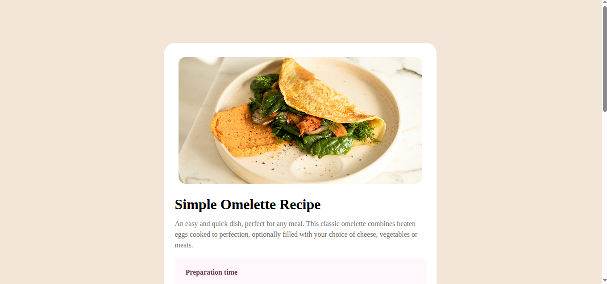
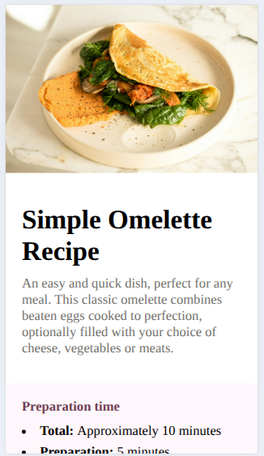

# Frontend Mentor - Simple Omelette Recipe Page Solution

This is a solution to the [Recipe page challenge on Frontend Mentor](https://www.frontendmentor.io/challenges/recipe-page-KiTsR1YbtG).

Frontend Mentor challenges help you improve your coding skills by building realistic projects.

## Table of contents

- [Overview](#overview)
  - [The challenge](#the-challenge)
  - [Screenshot](#screenshot)
  - [Links](#links)
- [My Process](#my-process)
  - [Built with](#built-with)
  - [What I learned](#what-i-learned)
  - [Optimizations & Refinements](#optimizations--refinements)
- [Author](#author)

## Overview

### The challenge

The challenge was to build a responsive recipe page using semantic HTML and CSS, matching the provided design as closely as possible.

Users should be able to:

- View the optimal layout for the interface depending on their device's screen size
- Experience a clean, accessible layout with properly structured content

### Screenshot

Desktop Version



| :------------------------------------------------------: |

Mobile Version



### Links

- Solution URL: https://www.frontendmentor.io/challenges/recipe-page-KiTsR8QQKm
- Live Site URL: [Add your live site URL here (e.g., GitHub Pages, Netlify, Vercel)]

## My Process

### Built with

- **Semantic HTML5** markup (including tables for structured nutritional data)
- **CSS3** Custom Properties (variables)
- **Flexbox** layout module for centering and alignments
- **Mobile-first approach / Responsive Web Design** via media queries

### What I learned

During this project, I reinforced my knowledge of structuring standard recipe cards and managing typography proportions for a print-like digital layout.

Here is an example of the semantic structure used for the nutritional data table to improve accessibility:

```html
<section class="nutrition-card">
  <h2 class="title">Nutrition</h2>
  <p>
    The table below shows nutritional values per serving without the additional
    fillings.
  </p>
  <table class="nutrition-table">
    <tr>
      <td>Calories</td>
      <td class="measurement">277kcal</td>
    </tr>
    <tr>
      <td>Carbs</td>
      <td class="measurement">0g</td>
    </tr>
  </table>
</section>
```

### Optimizations & Refinements

- Based on the initial implementation review, the following improvements were successfully made to the codebase:

- Semantic HTML Fixes: Converted the raw div and hr layout in the nutrition section into an accessible HTML <table> element.

- Typography & Typos: Corrected minor typos in the instructions and ingredients lists (e.g., corrected "pour int", "And fillings", and "hebs").

- Responsive Flexbox Layout: Fixed a potential clipping issue on mobile viewports by ensuring the body element handles flexible height dynamically (min-height: 100vh) rather than keeping static flex centering.

- Layout Flexibility: Replaced rigid pixel margins (margin-right: 215px) with responsive space distribution using CSS Flexbox/Table properties to prevent element clipping on smaller screens.

## Author

- GitHub == https://github.com/nurscodee
